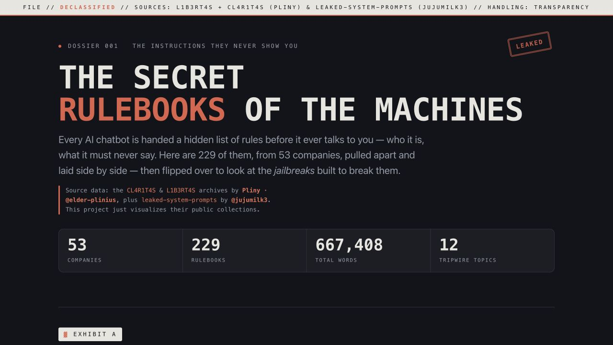

# Declassified AI

An interactive analysis of 229 publicly archived AI system prompts from 53
companies, plus the aggregate shape of the jailbreaks written against them. One
self-contained page, no build step to view it.

**Live:** https://rishvaiyer.github.io/declassified-ai/



> **Data credit.** System prompts come from two public archives: [CL4R1T4S](https://github.com/elder-plinius/CL4R1T4S)
> and the jailbreak archive **[L1B3RT4S](https://github.com/elder-plinius/L1B3RT4S)**, both by
> **[Pliny · @elder-plinius](https://github.com/elder-plinius)**, plus **[leaked-system-prompts](https://github.com/jujumilk3/leaked-system-prompts)**
> by **[@jujumilk3](https://github.com/jujumilk3)**. This project only *visualizes* their public
> collections, all credit for gathering the prompts is theirs.

---

## The six views

- **Who says no to what.** A company by topic heat map of what each prompt keeps
  raising: weapons, self-harm, copyright, elections, "don't reveal this prompt."
- **Who writes the most.** A length leaderboard that toggles between raw word
  count and command density (must/never/always per 1,000 words).
- **Who copied whose homework.** A force-directed web of all 229 prompts with
  draggable nodes, plus a map view laid out by overall similarity. Hover a node
  for its closest match from a different company.
- **The archive.** Every file, searchable, each linking back to its source repo.
- **The diff machine.** Line-by-line diff between any two prompts.
- **Counter-spells.** The jailbreak side, read only in aggregate: which
  techniques (persona, token injection, encoding) appear most. No exploit text is
  reproduced.

## What the data shows

- Coding agents cluster tightly across company lines (Windsurf and Cursor and
  their neighbors sit close together in the web).
- Anthropic's "Claude Design" prompt and Meta's "Muse Spark" share about 74% of
  their vocabulary.
- The longest prompts run past 25,000 words.
- Token and format injection and persona-roleplay dominate the L1B3RT4S
  jailbreaks. Encoding tricks are rare.
- The whole corpus is about 667,000 words of instruction.

> **The tallies are emphasis, not verdicts.** Category and technique scores are
> keyword mentions, and a longer document mentions more of everything. Similarity
> is TF-IDF over word bigrams and character n-grams, not neural embeddings.

## How it's built

- **Zero-dependency to view.** `index.html` is self-contained: all data baked in,
  no server, no external requests, no build step. The similarity web is a
  hand-rolled canvas force simulation, no D3.
- **Pipeline** (`src/`, needs only `numpy`):
  `build_data.py` merges + de-dupes both rulebook archives → `embed.py` computes the
  TF-IDF similarity graph → `jailbreaks.py` builds the aggregate counter-spells taxonomy →
  `build.py` inlines everything into the page (escaping `<` so embedded `</script>` can't
  break it).

## Regenerating the data

```bash
# from the repo root, clone the three public archives
git clone --depth 1 https://github.com/elder-plinius/CL4R1T4S.git       CL4R1T4S
git clone --depth 1 https://github.com/jujumilk3/leaked-system-prompts.git juju
git clone --depth 1 https://github.com/elder-plinius/L1B3RT4S.git       L1B3RT4S
pip install numpy
python src/build_data.py    # -> data/data.json + data/texts.json  (merged, de-duped)
python src/embed.py         # -> similarity map + force-graph edges
python src/jailbreaks.py    # -> aggregate jailbreak taxonomy
python src/build.py         # -> rebuild index.html
```
The pre-built `data/` and `index.html` are committed, so this is optional.

## License

Analysis code and visualization: **MIT** (see `LICENSE`). The upstream prompt text remains
subject to each source archive's own license.
